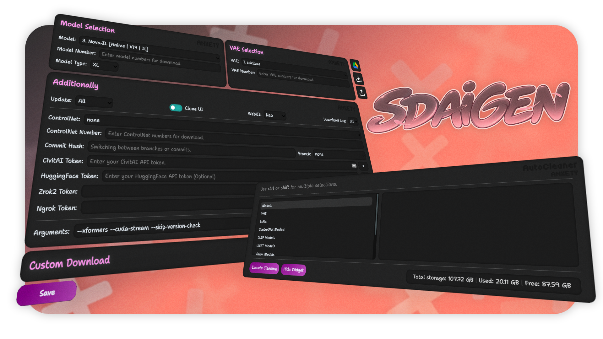
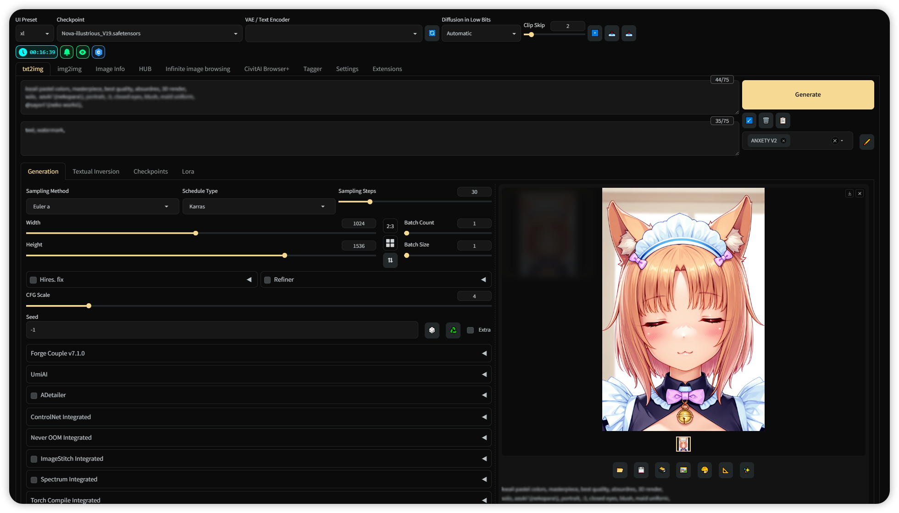
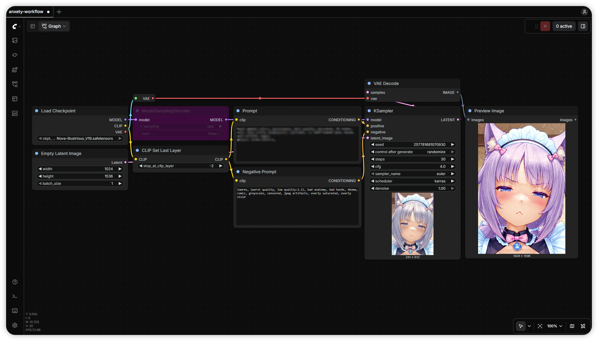

 
<h1>~ SDAIGEN | Stable Diffusion / ComfyUI | NoteBook V3 ~</h1>

[English](README.md) • Русский

🖥️ Предпросмотр UI

| WebUI | ComfyUI |
|:-----:|:-------:|
|  |  |

    
    
    

## 🌟 Особенности:
  - Мультиплатформенный блокнот: **Google Colab, Kaggle.**
  - *Виджеты* для простого взаимодействия.
  - Предустановленные пользовательские: *Настройки* + *Стили* + [*UI Тема*](https://github.com/anxety-solo/anxety-theme)
  - Скачивание превью для *моделей, LoRa и embedding* (CivitAI)
  - Выбор WebUI между *A1111, ComfyUI, Forge, Classic/Neo (Forge), ReForge, SD-UX.*
  - _Эксклюзив для **Google Colab**_: Подключение к GDrive: *Файлы, Генерации, Настройки UI.*

📚 Установленные Расширения

> ✔️ Установлено · ❌ Не установлено · 🔄 Интегрированная версия · `†` — Только в *Kaggle*

| Extension | A1111 | Forge | Classic | Neo | ReForge | SD-UX |
|-----------|:-----:|:-----:|:-------:|:---:|:-------:|:-----:|
| [adetailer](https://github.com/Bing-su/adetailer) | ✔️ | ✔️ | ✔️ | ✔️ | ✔️ | ✔️ |
| [anxety-theme](https://github.com/anxety-solo/anxety-theme) | ✔️ | ✔️ | ✔️ | ✔️ | ✔️ | ✔️ |
| [Aspect-Ratio-Plus](https://github.com/anxety-solo/sd-aspect-ratio-plus) | ✔️ | ✔️ | ✔️ | ✔️ | ✔️ | ✔️ |
| [Civitai-Browser-plus](https://github.com/anxety-solo/sd-civitai-browser-plus) | ✔️ | ✔️ | ✔️ | ✔️ | ✔️ | ✔️ |
| [Civitai-Extension](https://github.com/anxety-solo/sd-civitai-extension) | ✔️ | ✔️ | ✔️ | ✔️ | ✔️ | ✔️ |
| [ControlNet](https://github.com/Mikubill/sd-webui-controlnet) | ✔️ | 🔄 | 🔄 | 🔄 | 🔄 | ✔️ |
| [Encrypt-Image](https://github.com/anxety-solo/sd-encrypt-image) | ✔️† | ✔️† | ✔️† | ✔️† | ✔️† | ✔️† |
| [Image-Info](https://github.com/gutris1/sd-image-info) | ✔️ | ✔️ | ✔️ | ✔️ | ✔️ | ✔️ |
| [Image-Viewer](https://github.com/gutris1/sd-image-viewer) | ✔️ | ✔️ | ✔️ | ✔️ | ✔️ | ✔️ |
| [Infinite-Image-Browsing](https://github.com/zanllp/sd-webui-infinite-image-browsing) | ✔️ | ✔️ | ✔️ | ✔️ | ✔️ | ✔️ |
| [Regional-Prompter](https://github.com/hako-mikan/sd-webui-regional-prompter) | ✔️ | ✔️ | ✔️ | ❌ | ✔️ | ✔️ |
| [SD-Couple](https://github.com/Haoming02/sd-forge-couple) | ✔️ | ✔️ | ✔️ | ✔️ | ✔️ | ✔️ |
| [SD-wHub](https://github.com/Whyxeo/sd-whub-modelscope) | ✔️ | ✔️ | ✔️ | ✔️ | ✔️ | ✔️ |
| [sdAIgen-misc](https://github.com/anxety-solo/sdaigen-misc) | ✔️ | ✔️ | ✔️ | ✔️ | ✔️ | ❌ |
| [State](https://github.com/ilian6806/stable-diffusion-webui-state) | ✔️ | ✔️ | ✔️ | ✔️ | ✔️ | ✔️ |
| [SuperMerger](https://github.com/hako-mikan/sd-webui-supermerger) | ✔️ | ✔️ | ❌ | ❌ | ✔️ | ✔️ |
| [Tag-Complete](https://github.com/DominikDoom/a1111-sd-webui-tagcomplete) | ✔️ | ✔️ | ✔️ | ✔️ | ✔️ | ✔️ |
| [Umi-AI-Wildcards](https://github.com/anxety-solo/Umi-AI-Wildcards) | ✔️ | ✔️ | ✔️ | ✔️ | ✔️ | ✔️ |
| [Ultimate-Upscale](https://github.com/Coyote-A/ultimate-upscale-for-automatic1111) | ✔️ | ❌ | ✔️ | ✔️ | ✔️ | ✔️ |
| [WD14-Tagger](https://github.com/anxety-solo/sd-wd14-tagger) | ✔️ | ✔️ | ✔️ | ✔️ | ✔️ | ✔️ |

🧩 Установленные Кастомные-Ноды | ComfyUI

- [Advanced-ControlNet](https://github.com/Kosinkadink/ComfyUI-Advanced-ControlNet)
- [ComfyUI-Custom-Scripts](https://github.com/pythongosssss/ComfyUI-Custom-Scripts)
- [ComfyUI-GGUF](https://github.com/city96/ComfyUI-GGUF)
- [ComfyUI-Impact-Pack](https://github.com/ltdrdata/ComfyUI-Impact-Pack)
- [ComfyUI-Impact-Subpack](https://github.com/ltdrdata/ComfyUI-Impact-Subpack)
- [ComfyUI-Manager](https://github.com/ltdrdata/ComfyUI-Manager)
- [ComfyUI-Model-Manager](https://github.com/hayden-fr/ComfyUI-Model-Manager)
- [ControlNet-AUX](https://github.com/Fannovel16/comfyui_controlnet_aux)
- [Efficiency-Nodes](https://github.com/jags111/efficiency-nodes-comfyui)
- [WD14-Tagger](https://github.com/pythongosssss/ComfyUI-WD14-Tagger)

## 💖 Поддержать меня:

    
    

---

## 😄 Благодарности:

[gutris1](https://github.com/gutris1) - Спасибо ему за работу, скрипты, расширения и за то, что назвал меня геем 💀 
[NoCrypt](https://github.com/NoCrypt) - Блокнот изначально был построен на его версии :3 
[DEX-1101](https://github.com/DEX-1101) - В своё время предоставил нам Kaggle-версию~
